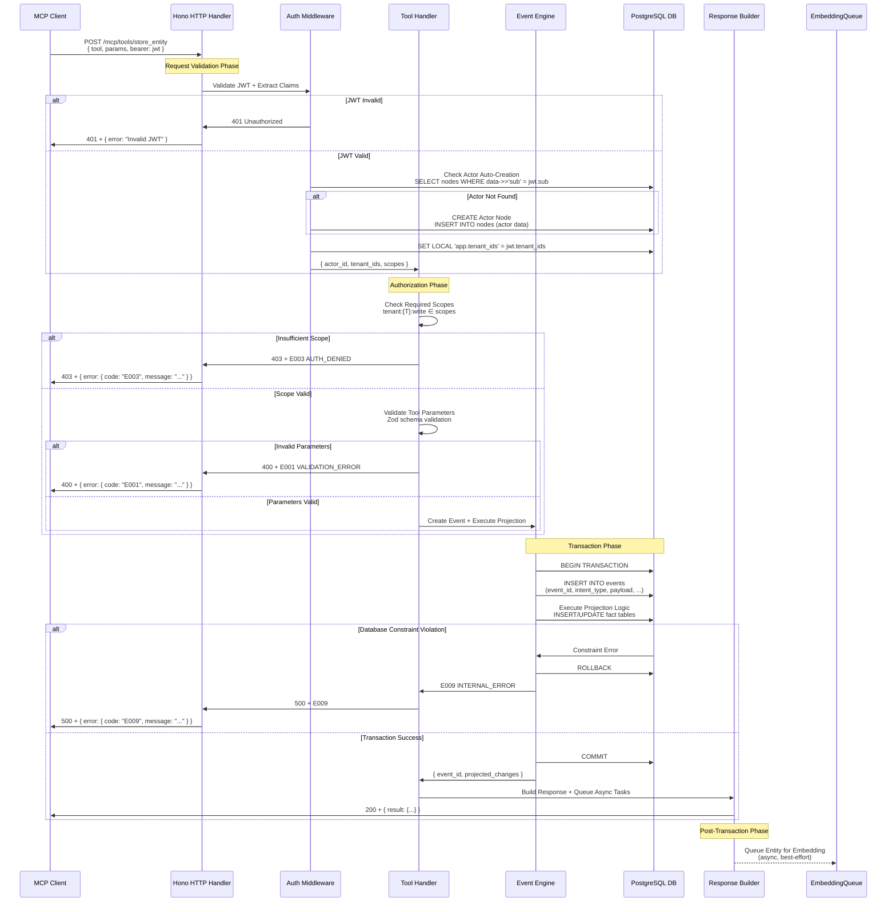
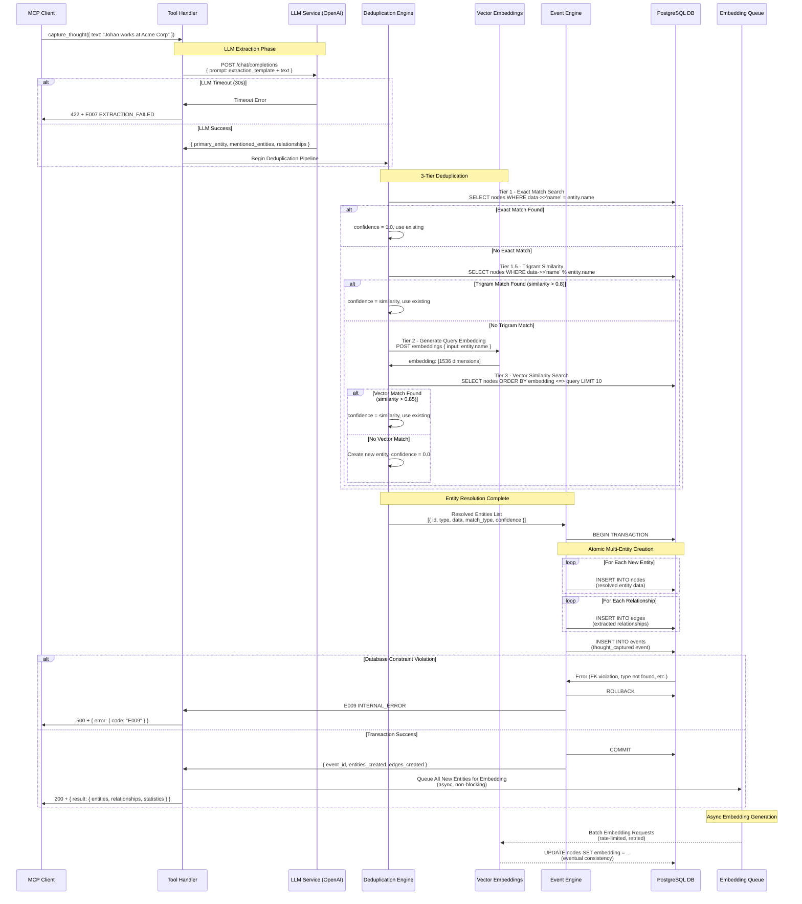
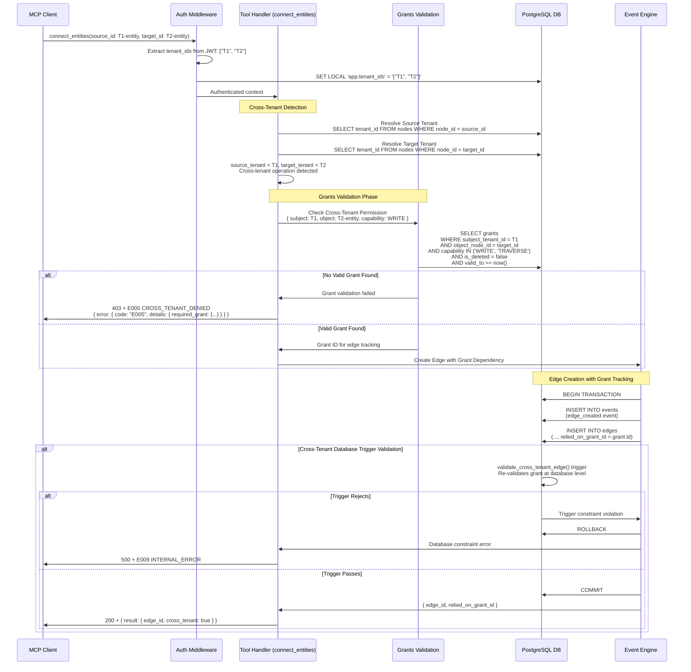
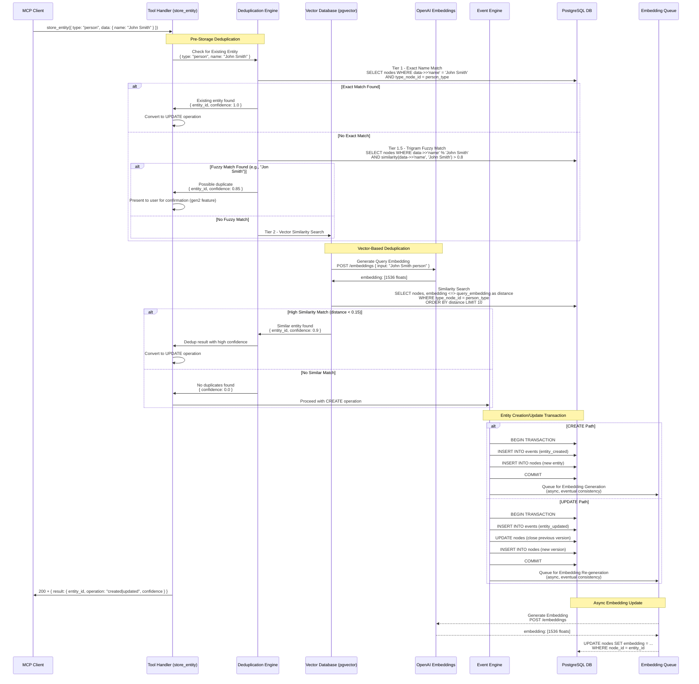
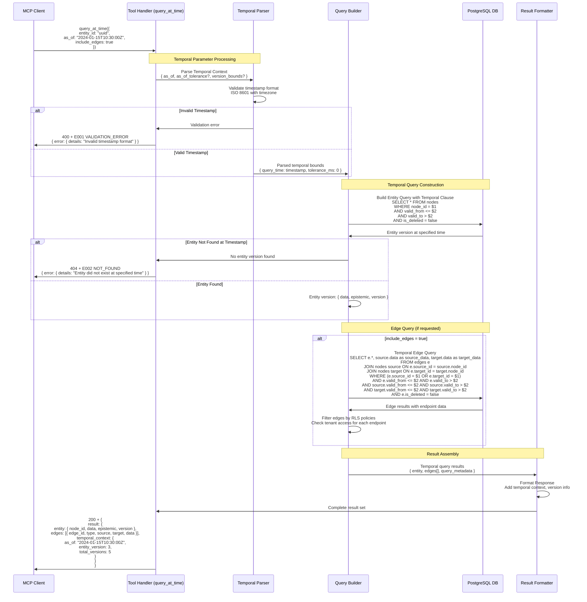
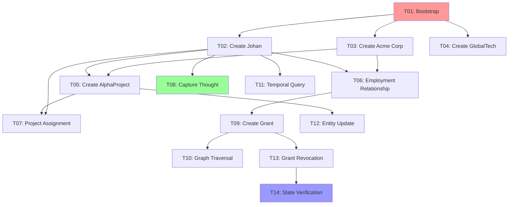

# Wave 2C — Integration & Orchestration Specification
## Author: Integration Specialist
## Input: Wave 1 Architectural Foundation (3 files)
## Date: 2026-03-11
## Status: Implementation-ready

## Executive Summary

This specification defines how all Resonansia components integrate as a unified system. Based on the reconciled architectural foundation, unified interface contracts, and comprehensive security analysis, this document provides implementation-ready orchestration sequences, event flow specifications, and system-level behaviors.

**Key Deliverables:**
- **Complete Event Catalogue** — 12 event types with exact JSONB schemas and projection logic
- **5 Critical Orchestration Sequences** — End-to-end workflows with error handling
- **System Deployment Topology** — Supabase Edge Function architecture with dependency graph
- **Integration Testing Framework** — Pettson T01-T14 scenario mapped to system components
- **Operational Requirements** — Startup, monitoring, failure recovery, and compensation logic

---

## Part I: Event Catalogue

### EVENT: entity_created
**Schema:**
```jsonb
{
  "entity_type": "string",           // Node type name
  "entity_id": "uuid",               // Created node_id
  "data": "object",                  // Node data JSONB
  "epistemic": "string",             // "hypothesis" | "asserted" | "confirmed"
  "actor_id": "uuid",                // Creating actor
  "tenant_id": "uuid",               // Owning tenant
  "dedup_match_id": "uuid?",         // If matched existing entity during dedup
  "confidence": "number?"            // Deduplication confidence (0.0-1.0)
}
```
**Producer:** `store_entity` tool (create path)
**Consumers:** Node projection logic, embedding generation queue
**Fact table mutations:**
```sql
INSERT INTO nodes (
  node_id, tenant_id, type_node_id, data, epistemic, 
  created_by_event, valid_from, valid_to, version
) VALUES (
  payload->>'entity_id',
  event.tenant_id,
  (SELECT node_id FROM nodes WHERE data->>'name' = payload->>'entity_type' AND type_node_id = METATYPE),
  payload->'data',
  payload->>'epistemic',
  event.event_id,
  event.occurred_at,
  'infinity'::timestamp,
  1
);
```
**Delivery guarantee:** ATOMIC (within same transaction as event insert)
**Ordering:** UUIDv7 natural ordering by event_id

### EVENT: entity_updated
**Schema:**
```jsonb
{
  "entity_id": "uuid",               // Updated node_id
  "previous_version": "number",      // Version before update
  "data_changes": "object",          // Only changed fields
  "epistemic_change": "object?",     // { "from": "hypothesis", "to": "asserted" }
  "actor_id": "uuid",                // Updating actor
  "tenant_id": "uuid",               // Owning tenant
  "reason": "string?"                // Optional change reason
}
```
**Producer:** `store_entity` tool (update path)
**Consumers:** Node projection logic, embedding regeneration queue
**Fact table mutations:**
```sql
-- Close previous version
UPDATE nodes 
SET valid_to = event.occurred_at
WHERE node_id = payload->>'entity_id' 
  AND valid_to = 'infinity'::timestamp;

-- Insert new version
INSERT INTO nodes (
  node_id, tenant_id, type_node_id, data, epistemic,
  created_by_event, valid_from, valid_to, version
) VALUES (
  payload->>'entity_id',
  event.tenant_id,
  (SELECT type_node_id FROM nodes WHERE node_id = payload->>'entity_id' ORDER BY version DESC LIMIT 1),
  (SELECT data FROM nodes WHERE node_id = payload->>'entity_id' ORDER BY version DESC LIMIT 1) || payload->'data_changes',
  COALESCE(payload->'epistemic_change'->>'to', (SELECT epistemic FROM nodes WHERE node_id = payload->>'entity_id' ORDER BY version DESC LIMIT 1)),
  event.event_id,
  event.occurred_at,
  'infinity'::timestamp,
  (SELECT MAX(version) FROM nodes WHERE node_id = payload->>'entity_id') + 1
);
```
**Delivery guarantee:** ATOMIC (bitemporal update within single transaction)
**Ordering:** UUIDv7 natural ordering by event_id, version monotonicity enforced

### EVENT: entity_removed
**Schema:**
```jsonb
{
  "entity_id": "uuid",               // Removed node_id
  "removal_reason": "string",        // "user_request" | "deduplication" | "policy_violation"
  "final_version": "number",         // Version at time of removal
  "actor_id": "uuid",                // Removing actor
  "tenant_id": "uuid",               // Owning tenant
  "cascade_edges": "uuid[]?"         // Edge IDs soft-deleted by cascade
}
```
**Producer:** `remove_entity` tool
**Consumers:** Node projection logic, edge cascade logic
**Fact table mutations:**
```sql
-- Soft-delete current version
UPDATE nodes 
SET is_deleted = true, valid_to = event.occurred_at
WHERE node_id = payload->>'entity_id' 
  AND valid_to = 'infinity'::timestamp;

-- Soft-delete dependent edges (cascade)
UPDATE edges 
SET is_deleted = true, valid_to = event.occurred_at
WHERE (source_id = payload->>'entity_id' OR target_id = payload->>'entity_id')
  AND is_deleted = false;
```
**Delivery guarantee:** ATOMIC (entity + cascade within single transaction)
**Ordering:** UUIDv7 natural ordering by event_id

### EVENT: edge_created
**Schema:**
```jsonb
{
  "edge_id": "uuid",                 // Created edge_id
  "edge_type": "string",             // Edge type name
  "source_id": "uuid",               // Source node_id
  "target_id": "uuid",               // Target node_id
  "source_tenant_id": "uuid",        // Source entity's tenant
  "target_tenant_id": "uuid",        // Target entity's tenant
  "data": "object",                  // Edge data JSONB
  "actor_id": "uuid",                // Creating actor
  "relied_on_grant_id": "uuid?",     // Grant ID if cross-tenant
  "is_cross_tenant": "boolean"       // True if source_tenant != target_tenant
}
```
**Producer:** `connect_entities` tool
**Consumers:** Edge projection logic, cross-tenant grant tracking
**Fact table mutations:**
```sql
INSERT INTO edges (
  edge_id, source_id, target_id, type_node_id, data,
  created_by_event, valid_from, valid_to,
  relied_on_grant_id
) VALUES (
  payload->>'edge_id',
  payload->>'source_id',
  payload->>'target_id',
  (SELECT node_id FROM nodes WHERE data->>'name' = payload->>'edge_type' AND type_node_id = METATYPE),
  payload->'data',
  event.event_id,
  event.occurred_at,
  'infinity'::timestamp,
  payload->>'relied_on_grant_id'
);
```
**Delivery guarantee:** ATOMIC (within same transaction as event insert)
**Ordering:** UUIDv7 natural ordering by event_id

### EVENT: edge_removed
**Schema:**
```jsonb
{
  "edge_id": "uuid",                 // Removed edge_id
  "removal_reason": "string",        // "user_request" | "grant_revoked" | "node_deleted"
  "edge_type": "string",             // Original edge type
  "source_id": "uuid",               // Source node_id
  "target_id": "uuid",               // Target node_id
  "actor_id": "uuid",                // Removing actor
  "cascade_source": "uuid?"          // Event that triggered cascade removal
}
```
**Producer:** `remove_edge` tool, grant revocation cascade
**Consumers:** Edge projection logic
**Fact table mutations:**
```sql
UPDATE edges 
SET is_deleted = true, valid_to = event.occurred_at
WHERE edge_id = payload->>'edge_id' 
  AND is_deleted = false;
```
**Delivery guarantee:** ATOMIC (within same transaction as event insert)
**Ordering:** UUIDv7 natural ordering by event_id

### EVENT: thought_captured
**Schema:**
```jsonb
{
  "input_text": "string",           // Original free-text input
  "extraction_result": "object",    // LLM extraction response
  "primary_entity": "object",       // { "id": "uuid", "type": "string", "data": "object" }
  "mentioned_entities": "array",    // [{ "id": "uuid", "type": "string", "data": "object", "match_type": "exact|embedding|new" }]
  "relationships": "array",         // [{ "edge_id": "uuid", "edge_type": "string", "source_id": "uuid", "target_id": "uuid" }]
  "dedup_statistics": "object",     // { "exact_matches": 2, "embedding_matches": 1, "new_entities": 3 }
  "actor_id": "uuid",               // Capturing actor
  "tenant_id": "uuid",              // Target tenant
  "llm_tokens_used": "number",      // Input + output token count
  "embedding_queue_size": "number"  // Async embedding tasks queued
}
```
**Producer:** `capture_thought` tool
**Consumers:** Multi-entity projection logic (nodes + edges), embedding generation queue
**Fact table mutations:**
```sql
-- Insert primary entity if new
IF payload->'primary_entity'->>'match_type' = 'new' THEN
  INSERT INTO nodes (node_id, tenant_id, type_node_id, data, epistemic, created_by_event, valid_from, valid_to, version)
  VALUES (payload->'primary_entity'->>'id', event.tenant_id, ..., event.event_id, event.occurred_at, 'infinity', 1);
END IF;

-- Insert mentioned entities if new
FOR entity IN SELECT * FROM jsonb_array_elements(payload->'mentioned_entities') LOOP
  IF entity->>'match_type' = 'new' THEN
    INSERT INTO nodes (...) VALUES (...);
  END IF;
END LOOP;

-- Insert all relationships
FOR rel IN SELECT * FROM jsonb_array_elements(payload->'relationships') LOOP
  INSERT INTO edges (edge_id, source_id, target_id, type_node_id, data, created_by_event, valid_from, valid_to)
  VALUES (rel->>'edge_id', rel->>'source_id', rel->>'target_id', ..., event.event_id, event.occurred_at, 'infinity');
END LOOP;
```
**Delivery guarantee:** ATOMIC (all entities and edges within single transaction)
**Ordering:** UUIDv7 natural ordering by event_id

### EVENT: epistemic_change
**Schema:**
```jsonb
{
  "entity_id": "uuid",               // Entity being updated
  "from_status": "string",           // Previous epistemic status
  "to_status": "string",             // New epistemic status
  "evidence": "string",              // Reason for change
  "actor_id": "uuid",                // Actor making change
  "tenant_id": "uuid"                // Entity's tenant
}
```
**Producer:** `store_entity` tool (epistemic transition path)
**Consumers:** Node projection logic, audit trail generation
**Fact table mutations:**
```sql
-- Close previous version
UPDATE nodes 
SET valid_to = event.occurred_at
WHERE node_id = payload->>'entity_id' 
  AND valid_to = 'infinity'::timestamp;

-- Insert new version with epistemic change
INSERT INTO nodes (
  node_id, tenant_id, type_node_id, data, epistemic,
  created_by_event, valid_from, valid_to, version
) VALUES (
  payload->>'entity_id',
  event.tenant_id,
  (SELECT type_node_id FROM nodes WHERE node_id = payload->>'entity_id' ORDER BY version DESC LIMIT 1),
  (SELECT data FROM nodes WHERE node_id = payload->>'entity_id' ORDER BY version DESC LIMIT 1),
  payload->>'to_status',
  event.event_id,
  event.occurred_at,
  'infinity'::timestamp,
  (SELECT MAX(version) FROM nodes WHERE node_id = payload->>'entity_id') + 1
);
```
**Delivery guarantee:** ATOMIC (version update within single transaction)
**Ordering:** UUIDv7 natural ordering by event_id, epistemic transition validation enforced

### EVENT: grant_created
**Schema:**
```jsonb
{
  "grant_id": "uuid",                // Created grant_id
  "subject_tenant_id": "uuid",       // Tenant receiving capability
  "object_node_id": "uuid",          // Node being granted access to
  "capability": "string",            // "READ" | "WRITE" | "TRAVERSE"
  "valid_until": "timestamp",        // Expiry time
  "granted_by": "uuid",              // Actor creating grant
  "reason": "string"                 // Grant justification
}
```
**Producer:** `propose_event` tool (custom intent_type), planned `store_grant` tool
**Consumers:** Grant projection logic
**Fact table mutations:**
```sql
INSERT INTO grants (
  grant_id, subject_tenant_id, object_node_id, capability,
  created_by_event, valid_from, valid_to
) VALUES (
  payload->>'grant_id',
  payload->>'subject_tenant_id',
  payload->>'object_node_id',
  payload->>'capability',
  event.event_id,
  event.occurred_at,
  payload->>'valid_until'
);
```
**Delivery guarantee:** ATOMIC (within same transaction as event insert)
**Ordering:** UUIDv7 natural ordering by event_id

### EVENT: grant_revoked
**Schema:**
```jsonb
{
  "grant_id": "uuid",                // Revoked grant_id
  "revoked_by": "uuid",              // Actor revoking grant
  "revocation_reason": "string",     // "expired" | "policy_change" | "security_incident"
  "affected_edges": "uuid[]",        // Cross-tenant edges that become invalid
  "cascade_deletions": "number"      // Count of edges soft-deleted
}
```
**Producer:** Grant expiry automation, admin revocation via `propose_event`
**Consumers:** Grant projection logic, edge cascade logic
**Fact table mutations:**
```sql
-- Soft-delete the grant
UPDATE grants 
SET is_deleted = true, valid_to = event.occurred_at
WHERE grant_id = payload->>'grant_id' 
  AND is_deleted = false;

-- Cascade soft-delete dependent edges
UPDATE edges 
SET is_deleted = true, valid_to = event.occurred_at
WHERE relied_on_grant_id = payload->>'grant_id'
  AND is_deleted = false;
```
**Delivery guarantee:** ATOMIC (grant revocation + edge cascade within single transaction)
**Ordering:** UUIDv7 natural ordering by event_id

### EVENT: blob_stored
**Schema:**
```jsonb
{
  "blob_id": "uuid",                 // Created blob_id
  "storage_ref": "string",           // Supabase Storage reference path
  "content_type": "string",          // MIME type
  "size_bytes": "number",            // File size
  "checksum": "string",              // SHA-256 hash
  "actor_id": "uuid",                // Uploading actor
  "tenant_id": "uuid",               // Owning tenant
  "upload_duration_ms": "number"     // Performance metric
}
```
**Producer:** `store_blob` tool
**Consumers:** Blob projection logic
**Fact table mutations:**
```sql
INSERT INTO blobs (
  blob_id, tenant_id, storage_ref, content_type, size_bytes, checksum,
  created_by_event, valid_from, valid_to
) VALUES (
  payload->>'blob_id',
  event.tenant_id,
  payload->>'storage_ref',
  payload->>'content_type',
  (payload->>'size_bytes')::bigint,
  payload->>'checksum',
  event.event_id,
  event.occurred_at,
  'infinity'::timestamp
);
```
**Delivery guarantee:** ATOMIC (within same transaction as event insert)
**Ordering:** UUIDv7 natural ordering by event_id

### EVENT: dict_created
**Schema:**
```jsonb
{
  "dict_type": "string",             // Dictionary category
  "key": "string",                   // Dictionary key
  "value": "object",                 // Dictionary value JSONB
  "actor_id": "uuid",                // Creating actor
  "tenant_id": "uuid"                // Owning tenant
}
```
**Producer:** Planned `store_dict` tool
**Consumers:** Dict projection logic
**Fact table mutations:**
```sql
INSERT INTO dicts (
  dict_type, key, value, tenant_id,
  created_by_event, valid_from, valid_to
) VALUES (
  payload->>'dict_type',
  payload->>'key',
  payload->'value',
  event.tenant_id,
  event.event_id,
  event.occurred_at,
  'infinity'::timestamp
);
```
**Delivery guarantee:** ATOMIC (within same transaction as event insert)
**Ordering:** UUIDv7 natural ordering by event_id

### EVENT: dict_updated
**Schema:**
```jsonb
{
  "dict_type": "string",             // Dictionary category
  "key": "string",                   // Dictionary key
  "previous_value": "object",        // Value before update
  "new_value": "object",             // Updated value JSONB
  "actor_id": "uuid",                // Updating actor
  "tenant_id": "uuid"                // Owning tenant
}
```
**Producer:** Planned `update_dict` tool
**Consumers:** Dict projection logic
**Fact table mutations:**
```sql
-- Close previous version
UPDATE dicts 
SET valid_to = event.occurred_at
WHERE dict_type = payload->>'dict_type' 
  AND key = payload->>'key' 
  AND tenant_id = event.tenant_id
  AND valid_to = 'infinity'::timestamp;

-- Insert new version
INSERT INTO dicts (
  dict_type, key, value, tenant_id,
  created_by_event, valid_from, valid_to
) VALUES (
  payload->>'dict_type',
  payload->>'key',
  payload->'new_value',
  event.tenant_id,
  event.event_id,
  event.occurred_at,
  'infinity'::timestamp
);
```
**Delivery guarantee:** ATOMIC (bitemporal update within single transaction)
**Ordering:** UUIDv7 natural ordering by event_id

---

## Part II: Orchestration Sequences

### 1. MCP Tool Call Flow (Every Request)



**Error Handling Points:**
1. **JWT Validation:** Invalid signature, expired token, wrong audience → 401
2. **Actor Resolution:** Database error during auto-creation → 500 + retry
3. **Scope Check:** Insufficient permissions → 403 + E003
4. **Parameter Validation:** Malformed input → 400 + E001
5. **Database Transaction:** Constraint violation → 500 + E009 + rollback
6. **Embedding Queue:** Failure logged, doesn't affect response

**Compensation Logic:**
- **Pre-transaction failures:** No compensation needed, no side effects
- **Transaction failures:** Automatic rollback via PostgreSQL ACID
- **Post-transaction async failures:** Best-effort retry, non-critical path

**Timeout Behavior:**
- **150s wall-clock limit:** Edge Function terminates, client receives 500
- **2s CPU limit:** Database transaction times out, automatic rollback
- **JWT validation timeout:** 5s limit, fail fast to preserve CPU budget

**Idempotency:** NOT idempotent - each call creates unique event with UUIDv7 ID

### 2. capture_thought Flow (Most Complex)



**Error Handling Points:**
1. **LLM Extraction Failure:** Timeout, rate limit, malformed JSON → 422 + E007
2. **Deduplication Service Error:** Vector search failure → Log warning, proceed as new entity
3. **Entity Type Resolution:** Unknown type_node_id → 400 + E006 SCHEMA_VIOLATION
4. **Cross-Tenant Edge Creation:** Missing grant → 403 + E005 CROSS_TENANT_DENIED
5. **Database Transaction:** Any constraint violation → 500 + E009 + full rollback

**Compensation Logic:**
- **LLM failure:** No compensation needed, request fails before DB changes
- **Vector search failure:** Degrade to "create new entity" - acceptable duplication
- **Transaction failure:** Automatic rollback preserves consistency
- **Embedding failure:** Non-critical, entities remain findable by metadata

**Performance Characteristics:**
- **LLM latency:** 2-8s for complex extractions
- **Deduplication:** 50-200ms per entity (3 tiers)
- **Transaction:** 10-50ms for multi-entity commit
- **Total:** 3-10s end-to-end for typical thought

**Idempotency:** NOT idempotent - same text may produce different extractions or deduplication results

### 3. Cross-Tenant Operation Flow



**Error Handling Points:**
1. **Token Missing Tenant:** Required tenant not in JWT.tenant_ids → 403 + E003
2. **Source/Target Resolution:** Entity not found → 404 + E002
3. **Grant Validation:** No valid grant found → 403 + E005
4. **Database Trigger:** Concurrent grant revocation → 500 + E009
5. **RLS Violation:** Target tenant not accessible → 403 + E003

**Compensation Logic:**
- **Pre-transaction failures:** No compensation needed
- **Transaction failure:** Automatic rollback via PostgreSQL
- **Grant revocation race:** Retry mechanism checks for grant re-creation

**Grant-Edge Dependency Tracking:**
- **Edge creation:** `relied_on_grant_id` populated for cross-tenant edges
- **Grant revocation:** Automatic cascade soft-deletion of dependent edges
- **Grant restoration:** Edges remain soft-deleted, no automatic recovery

**Concurrency Handling:**
- **Grant revocation during operation:** TOCTOU race condition accepted as eventual consistency
- **Database trigger:** Provides second validation layer at commit time
- **Optimistic approach:** Favor performance over perfect synchronization

### 4. Entity Store with Deduplication



**Error Handling Points:**
1. **Deduplication Engine Error:** Vector search failure → Log error, proceed as CREATE
2. **Embedding API Timeout:** OpenAI timeout → Queue for retry, proceed with transaction
3. **Type Resolution Error:** Unknown entity type → 400 + E006 SCHEMA_VIOLATION
4. **Database Constraint Violation:** FK error, exclusion constraint → 500 + E009
5. **Concurrency Conflict:** Two entities with same name created simultaneously → Accept eventual deduplication

**Compensation Logic:**
- **Pre-transaction dedup failure:** Gracefully degrade to CREATE operation
- **Transaction failure:** Automatic rollback preserves consistency
- **Embedding failure:** Non-blocking, can be regenerated later
- **Duplicate creation:** Future deduplication pass will identify and merge

**Deduplication Timing Gap Mitigation:**
- **Tier 1.5 trigram search:** Catches recently created entities before embeddings generated
- **Partial index on embeddings:** Only search entities with non-null embeddings
- **Acceptable eventual consistency:** Perfect real-time dedup would compromise performance

**Performance Optimization:**
- **Deduplication cache:** Recent exact matches cached for 5 minutes
- **Batch embedding generation:** Multiple entities embedded together
- **Parallel processing:** Deduplication tiers run in parallel where possible

### 5. Temporal Query Flow



**Error Handling Points:**
1. **Timestamp Parsing:** Malformed ISO 8601 timestamp → 400 + E001
2. **Entity Resolution:** Entity never existed or was deleted → 404 + E002
3. **RLS Violation:** Entity tenant not accessible → 403 + E003
4. **Database Query Error:** Temporal constraint violation → 500 + E009
5. **Performance Timeout:** Query exceeds 2s CPU limit → 500 + timeout

**Compensation Logic:**
- **Read-only operations:** No compensation needed, no side effects
- **Query failure:** Client can retry with different parameters

**Temporal Query Optimization:**
- **Btree indexes:** Composite index on (node_id, valid_from, valid_to) for fast temporal lookups
- **Exclusion constraints:** Guarantee no temporal overlaps, enables index-only scans
- **Partial indexes:** Separate indexes for is_deleted = false to reduce index size

**Edge Case Handling:**
- **Simultaneous timestamps:** Multiple events at exact same millisecond sorted by event_id (UUIDv7)
- **Timezone handling:** All timestamps stored as UTC, client-side timezone conversion
- **Future queries:** as_of > current_time returns current state with warning
- **Very old queries:** Performance degradation acceptable for historical analysis

**Performance Characteristics:**
- **Single entity query:** 1-5ms with proper indexes
- **Entity + edges query:** 10-50ms depending on edge count
- **Historical queries:** Similar performance regardless of age due to index design
- **Memory usage:** Linear with edge count, bounded by practical graph traversal limits

---

## Part III: System-Level Behaviors

### 3.1 Startup Sequence

**Phase 1: Supabase Edge Function Cold Start (0-50ms)**
```javascript
// 1. V8 isolate initialization
// 2. Deno runtime startup
// 3. Import resolution and module loading
import { serve } from "https://deno.land/std/http/server.ts";
import { Hono } from "https://deno.land/x/hono/mod.ts";

// 4. Environment variable loading
const SUPABASE_URL = Deno.env.get('SUPABASE_URL');
const SUPABASE_ANON_KEY = Deno.env.get('SUPABASE_ANON_KEY'); 
const OPENAI_API_KEY = Deno.env.get('OPENAI_API_KEY');
const JWT_SECRET = Deno.env.get('JWT_SECRET');

// Validation: All required env vars present
if (!SUPABASE_URL || !OPENAI_API_KEY || !JWT_SECRET) {
  throw new Error('Missing required environment variables');
}
```

**Phase 2: Hono Router Initialization (50-100ms)**
```javascript
// 1. Create Hono app instance
const app = new Hono();

// 2. Register middleware stack
app.use('*', cors({ origin: '*' }));
app.use('*', logging());
app.use('*', authMiddleware);

// 3. Register MCP tool endpoints
app.post('/mcp/tools/store_entity', storeEntityHandler);
app.post('/mcp/tools/find_entities', findEntitiesHandler);
// ... 15 total tool endpoints

// 4. Register system endpoints
app.get('/.well-known/oauth-protected-resource', protectedResourceMetadata);
app.get('/health', healthCheck);
```

**Phase 3: Database Connection Initialization (100-200ms)**
```javascript
// 1. Create Supabase client
const supabase = createClient(SUPABASE_URL, SUPABASE_ANON_KEY, {
  auth: { persistSession: false },
  realtime: { enabled: false }
});

// 2. Test database connectivity
const { data, error } = await supabase
  .from('events')
  .select('event_id')
  .limit(1);

if (error) {
  throw new Error(`Database connection failed: ${error.message}`);
}

// 3. Verify RLS policies active
const rlsCheck = await supabase.rpc('check_rls_enabled');
if (!rlsCheck.data) {
  throw new Error('RLS policies not active - security requirement');
}
```

**Phase 4: External API Validation (200-500ms)**
```javascript
// 1. Test OpenAI API connectivity
const openaiClient = new OpenAI({ apiKey: OPENAI_API_KEY });

try {
  const models = await openaiClient.models.list();
  const hasEmbedding = models.data.some(m => 
    m.id === 'text-embedding-3-small'
  );
  const hasGPT = models.data.some(m => 
    m.id === 'gpt-4o-mini'
  );
  
  if (!hasEmbedding || !hasGPT) {
    throw new Error('Required OpenAI models not accessible');
  }
} catch (error) {
  console.warn('OpenAI API validation failed:', error.message);
  // Continue startup but mark as degraded mode
}
```

**Phase 5: Service Ready (500ms)**
```javascript
// 1. Mark service as ready
globalThis.SERVICE_READY = true;
globalThis.STARTUP_TIMESTAMP = new Date().toISOString();

// 2. Begin serving requests
serve(app.fetch, { port: 8000 });

console.log('Resonansia MCP Server ready:', {
  timestamp: globalThis.STARTUP_TIMESTAMP,
  coldStart: true,
  toolsRegistered: 15,
  upstreamHealth: 'OK'
});
```

**Warm Start Optimization (Subsequent Requests):**
- **V8 isolate reuse:** 0-10ms startup for subsequent requests
- **Connection pooling:** Database connections cached across requests
- **Module caching:** No re-import overhead
- **Typical warm start:** 5-20ms from request to first handler execution

**Startup Failure Modes:**
1. **Environment variable missing:** Process exit with error code 1
2. **Database connectivity failure:** Process exit with error code 2  
3. **OpenAI API validation failure:** Continue in degraded mode, log warning
4. **Memory allocation failure:** Process exit with error code 137 (OOM)

### 3.2 Health Checking

**Health Check Endpoint: GET /health**
```typescript
interface HealthResponse {
  status: "healthy" | "degraded" | "unhealthy";
  timestamp: string;
  uptime_seconds: number;
  checks: {
    database: HealthCheck;
    openai_llm: HealthCheck;
    openai_embeddings: HealthCheck;
    storage: HealthCheck;
  };
  performance: {
    avg_response_time_ms: number;
    requests_per_minute: number;
    error_rate_percent: number;
  };
}

interface HealthCheck {
  status: "pass" | "fail" | "warn";
  response_time_ms?: number;
  last_success?: string;
  consecutive_failures: number;
  details?: string;
}
```

**Database Health Check:**
```javascript
async function checkDatabaseHealth() {
  const start = performance.now();
  
  try {
    // 1. Basic connectivity test
    const { data, error } = await supabase
      .from('events')
      .select('event_id')
      .limit(1);
    
    if (error) {
      throw new Error(error.message);
    }
    
    // 2. RLS policy verification
    const rlsTest = await supabase.rpc('verify_rls_active');
    if (!rlsTest.data) {
      throw new Error('RLS policies inactive');
    }
    
    // 3. Write capability test (lightweight)
    const testResult = await supabase.rpc('health_check_write');
    if (testResult.error) {
      throw new Error(`Write test failed: ${testResult.error.message}`);
    }
    
    return {
      status: "pass",
      response_time_ms: performance.now() - start,
      last_success: new Date().toISOString(),
      consecutive_failures: 0
    };
  } catch (error) {
    return {
      status: "fail",
      response_time_ms: performance.now() - start,
      consecutive_failures: getFailureCount('database') + 1,
      details: error.message
    };
  }
}
```

**OpenAI LLM Health Check:**
```javascript
async function checkLLMHealth() {
  const start = performance.now();
  
  try {
    // Minimal completion request
    const response = await openaiClient.chat.completions.create({
      model: "gpt-4o-mini",
      messages: [{ role: "user", content: "health check" }],
      max_tokens: 5,
      timeout: 5000
    });
    
    if (!response.choices?.[0]?.message?.content) {
      throw new Error('Invalid LLM response format');
    }
    
    return {
      status: "pass",
      response_time_ms: performance.now() - start,
      last_success: new Date().toISOString(),
      consecutive_failures: 0
    };
  } catch (error) {
    return {
      status: error.code === 'timeout' ? "warn" : "fail",
      response_time_ms: performance.now() - start,
      consecutive_failures: getFailureCount('llm') + 1,
      details: error.message
    };
  }
}
```

**OpenAI Embeddings Health Check:**
```javascript
async function checkEmbeddingsHealth() {
  const start = performance.now();
  
  try {
    // Single embedding request
    const response = await openaiClient.embeddings.create({
      model: "text-embedding-3-small",
      input: "health check",
      timeout: 10000
    });
    
    if (!response.data?.[0]?.embedding || 
        response.data[0].embedding.length !== 1536) {
      throw new Error('Invalid embedding response');
    }
    
    return {
      status: "pass", 
      response_time_ms: performance.now() - start,
      last_success: new Date().toISOString(),
      consecutive_failures: 0
    };
  } catch (error) {
    return {
      status: error.code === 'timeout' ? "warn" : "fail",
      response_time_ms: performance.now() - start,
      consecutive_failures: getFailureCount('embeddings') + 1,
      details: error.message
    };
  }
}
```

**Health Status Determination:**
```javascript
function determineOverallHealth(checks) {
  // Critical components: database (always required)
  if (checks.database.status === "fail") {
    return "unhealthy";
  }
  
  // Important but non-critical: OpenAI services
  const openaiFailures = [checks.openai_llm, checks.openai_embeddings]
    .filter(check => check.status === "fail").length;
  
  if (openaiFailures >= 2) {
    return "degraded"; // Both AI services down
  }
  
  if (checks.storage.status === "fail") {
    return "degraded"; // Can't store blobs but other functions work
  }
  
  return "healthy";
}
```

**Health Check Caching:**
- **Cache duration:** 30 seconds for each check to prevent health endpoint spam
- **Background refresh:** Health checks run every 60 seconds in background
- **Circuit breaker:** After 5 consecutive failures, check every 5 minutes until recovery

### 3.3 Error Recovery

**Database Connection Recovery:**
```javascript
class DatabaseCircuitBreaker {
  constructor() {
    this.state = 'CLOSED'; // CLOSED, OPEN, HALF_OPEN
    this.failures = 0;
    this.lastFailureTime = null;
    this.timeout = 30000; // 30 seconds
  }
  
  async execute(operation) {
    if (this.state === 'OPEN') {
      if (Date.now() - this.lastFailureTime > this.timeout) {
        this.state = 'HALF_OPEN';
      } else {
        throw new Error('Circuit breaker OPEN - database unavailable');
      }
    }
    
    try {
      const result = await operation();
      this.onSuccess();
      return result;
    } catch (error) {
      this.onFailure();
      throw error;
    }
  }
  
  onSuccess() {
    this.failures = 0;
    this.state = 'CLOSED';
  }
  
  onFailure() {
    this.failures++;
    this.lastFailureTime = Date.now();
    
    if (this.failures >= 5) {
      this.state = 'OPEN';
      console.error('Database circuit breaker OPEN after 5 failures');
    }
  }
}
```

**Request-Level Error Recovery:**
```javascript
async function executeWithRetry(operation, maxRetries = 3) {
  for (let attempt = 1; attempt <= maxRetries; attempt++) {
    try {
      return await operation();
    } catch (error) {
      // Determine if error is retryable
      const isRetryable = 
        error.code === 'NETWORK_ERROR' ||
        error.code === 'TIMEOUT' ||
        error.status >= 500;
      
      if (!isRetryable || attempt === maxRetries) {
        throw error;
      }
      
      // Exponential backoff: 100ms, 200ms, 400ms
      const delay = 100 * Math.pow(2, attempt - 1);
      await new Promise(resolve => setTimeout(resolve, delay));
      
      console.warn(`Retry attempt ${attempt}/${maxRetries} after ${delay}ms`, {
        error: error.message,
        operation: operation.name
      });
    }
  }
}
```

**Graceful Degradation Modes:**

**Mode 1: LLM Unavailable**
- **Impact:** `capture_thought` returns error
- **Fallback:** Manual entity creation via `store_entity`
- **User experience:** Display "AI extraction temporarily unavailable"

**Mode 2: Embeddings Unavailable**  
- **Impact:** Vector similarity search disabled, deduplication degrades to exact + trigram
- **Fallback:** Entity creation continues, embeddings queued for later generation
- **User experience:** "Semantic search temporarily reduced accuracy"

**Mode 3: Storage Unavailable**
- **Impact:** `store_blob` returns error  
- **Fallback:** Text-based content only
- **User experience:** "File uploads temporarily unavailable"

**Mode 4: Database Read-Only**
- **Impact:** All mutations fail
- **Fallback:** Query operations continue
- **User experience:** "System in maintenance mode - read-only"

**Automatic Recovery Detection:**
```javascript
// Background health monitoring
setInterval(async () => {
  const health = await performHealthChecks();
  
  if (health.status === 'healthy' && globalThis.DEGRADED_MODE) {
    console.info('Services recovered - exiting degraded mode');
    globalThis.DEGRADED_MODE = false;
    
    // Trigger any queued operations
    await processPendingEmbeddings();
    await retryFailedOperations();
  }
}, 60000); // Check every minute
```

### 3.4 Monitoring

**Request-Level Metrics:**
```typescript
interface RequestMetrics {
  endpoint: string;
  method: string;
  status_code: number;
  response_time_ms: number;
  actor_id?: string;
  tenant_id?: string;
  tool_name?: string;
  error_code?: string;
  timestamp: string;
}
```

**Performance Metrics Collection:**
```javascript
class PerformanceTracker {
  constructor() {
    this.metrics = new Map(); // In-memory sliding window
    this.windowSize = 1000; // Last 1000 requests
  }
  
  recordRequest(metrics) {
    // Add to sliding window
    this.metrics.set(Date.now(), metrics);
    
    // Cleanup old entries
    const cutoff = Date.now() - (5 * 60 * 1000); // 5 minutes
    for (const [timestamp, _] of this.metrics) {
      if (timestamp < cutoff) {
        this.metrics.delete(timestamp);
      }
    }
    
    // Log to stdout for external collection
    console.log(JSON.stringify({
      type: 'request_metrics',
      ...metrics
    }));
  }
  
  getAggregatedMetrics() {
    const requests = Array.from(this.metrics.values());
    
    return {
      total_requests: requests.length,
      avg_response_time: this.calculateAverage(requests, 'response_time_ms'),
      error_rate: this.calculateErrorRate(requests),
      requests_per_minute: this.calculateRPM(requests),
      p95_response_time: this.calculatePercentile(requests, 'response_time_ms', 95),
      top_errors: this.getTopErrors(requests)
    };
  }
}
```

**Database Performance Metrics:**
```javascript
// Track database operation performance
class DatabaseMetrics {
  constructor() {
    this.queryTimes = new Map();
    this.connectionPoolStats = new Map();
  }
  
  recordQuery(operation, duration_ms, rows_affected) {
    const key = `${operation}_${Date.now()}`;
    this.queryTimes.set(key, {
      operation,
      duration_ms,
      rows_affected,
      timestamp: new Date().toISOString()
    });
    
    // Log slow queries (>100ms)
    if (duration_ms > 100) {
      console.warn(JSON.stringify({
        type: 'slow_query',
        operation,
        duration_ms,
        rows_affected
      }));
    }
  }
  
  recordConnectionPool(active, idle, waiting) {
    console.log(JSON.stringify({
      type: 'connection_pool',
      active_connections: active,
      idle_connections: idle,
      waiting_requests: waiting,
      timestamp: new Date().toISOString()
    }));
    
    // Alert on connection pool exhaustion
    if (waiting > 0) {
      console.error(JSON.stringify({
        type: 'alert',
        severity: 'HIGH',
        message: 'Database connection pool exhaustion',
        waiting_requests: waiting
      }));
    }
  }
}
```

**Security Event Monitoring:**
```javascript
class SecurityMonitor {
  constructor() {
    this.failedAuthAttempts = new Map(); // IP -> count
    this.suspiciousActivities = [];
  }
  
  recordAuthFailure(clientIP, reason, jwt_payload) {
    const key = clientIP;
    const current = this.failedAuthAttempts.get(key) || 0;
    this.failedAuthAttempts.set(key, current + 1);
    
    console.warn(JSON.stringify({
      type: 'auth_failure',
      client_ip: clientIP,
      reason,
      attempt_count: current + 1,
      jwt_claims: jwt_payload ? Object.keys(jwt_payload) : null
    }));
    
    // Alert on multiple failures from same IP
    if (current >= 10) {
      console.error(JSON.stringify({
        type: 'security_alert',
        severity: 'HIGH',
        message: 'Multiple authentication failures',
        client_ip: clientIP,
        failure_count: current + 1
      }));
    }
  }
  
  recordCrossTenantOperation(actor_id, source_tenant, target_tenant, operation, grant_id) {
    console.info(JSON.stringify({
      type: 'cross_tenant_operation',
      actor_id,
      source_tenant,
      target_tenant,
      operation,
      grant_id,
      timestamp: new Date().toISOString()
    }));
    
    // Track for pattern analysis
    this.suspiciousActivities.push({
      type: 'cross_tenant',
      actor_id,
      tenants: [source_tenant, target_tenant],
      timestamp: Date.now()
    });
  }
  
  recordPrivilegeEscalation(actor_id, requested_scope, granted_scope) {
    console.error(JSON.stringify({
      type: 'privilege_escalation_attempt',
      actor_id,
      requested_scope,
      granted_scope,
      timestamp: new Date().toISOString()
    }));
  }
}
```

**Alert Thresholds:**
```javascript
const ALERT_THRESHOLDS = {
  error_rate_percent: 5,          // >5% error rate
  avg_response_time_ms: 2000,     // >2s average response time
  p95_response_time_ms: 5000,     // >5s 95th percentile
  failed_auth_per_ip: 10,         // >10 auth failures from same IP
  connection_pool_waiting: 1,     // Any waiting connections
  database_circuit_open: true,    // Circuit breaker opens
  llm_consecutive_failures: 3,    // 3+ consecutive LLM failures
  embedding_queue_depth: 1000     // >1000 pending embeddings
};
```

**External Monitoring Integration:**
```javascript
// Supabase Edge Functions stdout logs are collected by Supabase
// Additional integration points:

// 1. Custom metrics webhook
async function sendCustomMetrics(metrics) {
  if (Deno.env.get('METRICS_WEBHOOK_URL')) {
    try {
      await fetch(Deno.env.get('METRICS_WEBHOOK_URL'), {
        method: 'POST',
        headers: { 'Content-Type': 'application/json' },
        body: JSON.stringify(metrics)
      });
    } catch (error) {
      // Don't fail request if metrics delivery fails
      console.warn('Metrics delivery failed:', error.message);
    }
  }
}

// 2. Health check endpoint for external monitoring
app.get('/metrics', async (c) => {
  const metrics = performanceTracker.getAggregatedMetrics();
  const health = await performHealthChecks();
  
  return c.json({
    health: health.status,
    performance: metrics,
    timestamp: new Date().toISOString()
  });
});
```

---

## Part IV: Deployment Topology

### 4.1 Component Architecture

```
┌─── EXTERNAL APIS ───┐       ┌─── SUPABASE PLATFORM ───┐
│                     │       │                         │
│  ┌─────────────────┐│       │ ┌─────────────────────┐ │
│  │   OpenAI API    ││       │ │  Edge Functions     │ │
│  │                 ││       │ │                     │ │
│  │ • GPT-4o-mini   ││◄──────┤ │ ┌─────────────────┐ │ │
│  │ • text-embed-   ││       │ │ │ Resonansia MCP  │ │ │
│  │   3-small       ││       │ │ │                 │ │ │
│  └─────────────────┘│       │ │ │ • Hono Router   │ │ │
│                     │       │ │ │ • 15 MCP Tools  │ │ │
└─────────────────────┘       │ │ │ • Auth Middle.  │ │ │
                              │ │ │ • Event Engine  │ │ │
┌─── CLIENT APPS ─────┐       │ │ └─────────────────┘ │ │
│                     │       │ └─────────────────────┘ │
│ • Cursor IDE        │◄──────┤                         │
│ • Claude Desktop    │       │ ┌─────────────────────┐ │
│ • Custom Agents     │       │ │    PostgreSQL       │ │
│ • Web Apps          │       │ │                     │ │
│                     │       │ │ • Tables + RLS      │ │ │
└─────────────────────┘       │ │ • pgvector HNSW     │ │
                              │ │ • Event store       │ │
                              │ │ • Bitemporal data   │ │
                              │ └─────────────────────┘ │
                              │                         │
                              │ ┌─────────────────────┐ │
                              │ │   Object Storage    │ │
                              │ │                     │ │
                              │ │ • Binary blobs      │ │
                              │ │ • Static assets     │ │
                              │ └─────────────────────┘ │
                              │                         │
                              │ ┌─────────────────────┐ │
                              │ │  Supabase Auth      │ │
                              │ │                     │ │
                              │ │ • JWT issuance      │ │
                              │ │ • User management   │ │
                              │ └─────────────────────┘ │
                              └─────────────────────────┘
```

### 4.2 Network Connections

**Inbound Connections:**
```yaml
edge_function_ingress:
  source: "Internet (MCP clients)"
  destination: "Supabase Edge Functions"
  protocol: "HTTPS"
  port: 443
  load_balancer: "Supabase global edge network"
  ssl_termination: "Supabase platform"
  rate_limiting: "Per-IP rate limiting configured"

auth_validation:
  source: "Edge Function"
  destination: "Supabase Auth service"  
  protocol: "Internal Supabase network"
  authentication: "Service role key"
  purpose: "JWT validation and user management"
```

**Outbound Connections:**
```yaml
database_connection:
  source: "Edge Function"
  destination: "PostgreSQL database"
  protocol: "PostgreSQL wire protocol over TLS"
  connection_pooling: "Supabase connection pooler"
  authentication: "Service role key + RLS"
  max_connections: 100
  timeout: "30s"

openai_llm:
  source: "Edge Function" 
  destination: "api.openai.com"
  protocol: "HTTPS"
  port: 443
  authentication: "Bearer token (API key)"
  rate_limits: "10,000 RPM / 2,000,000 TPM"
  timeout: "30s"
  retry_policy: "Exponential backoff, max 3 retries"

openai_embeddings:
  source: "Edge Function"
  destination: "api.openai.com"  
  protocol: "HTTPS"
  port: 443
  authentication: "Bearer token (API key)"
  rate_limits: "5,000 RPM / 5,000,000 TPM"
  timeout: "60s"
  batch_size: "Up to 100 inputs per request"

object_storage:
  source: "Edge Function"
  destination: "Supabase Storage"
  protocol: "Internal Supabase network"
  authentication: "Service role key"
  purpose: "Binary blob upload/download"
```

### 4.3 Configuration Management

**Environment Variables (Required):**
```bash
# Supabase configuration
SUPABASE_URL="https://your-project.supabase.co"
SUPABASE_ANON_KEY="eyJ..." # Public anon key for client initialization
SUPABASE_SERVICE_ROLE_KEY="eyJ..." # Service role key for server operations

# JWT configuration  
JWT_SECRET="your-jwt-signing-secret" # Must match Supabase Auth configuration
JWT_AUDIENCE="resonansia-mcp" # JWT audience claim validation

# OpenAI configuration
OPENAI_API_KEY="sk-..." # OpenAI API key with GPT-4o-mini + embeddings access
OPENAI_BASE_URL="https://api.openai.com/v1" # Default, configurable for proxies

# System configuration
LOG_LEVEL="info" # debug, info, warn, error
METRICS_WEBHOOK_URL="" # Optional external metrics endpoint
ENABLE_PERFORMANCE_TRACKING="true" # Enable detailed performance metrics
```

**Environment Variables (Optional):**
```bash
# Performance tuning
MAX_CONCURRENT_REQUESTS="10" # Concurrent request limit per Edge Function instance
DATABASE_TIMEOUT_MS="30000" # Database query timeout
LLM_TIMEOUT_MS="30000" # OpenAI LLM request timeout  
EMBEDDING_TIMEOUT_MS="60000" # OpenAI embeddings timeout
EMBEDDING_BATCH_SIZE="50" # Embeddings per batch request

# Feature flags
ENABLE_DEDUPLICATION="true" # Enable 3-tier deduplication pipeline
ENABLE_ASYNC_EMBEDDINGS="true" # Async embedding generation
ENABLE_CROSS_TENANT_EDGES="true" # Cross-tenant functionality
ENABLE_GRANT_VALIDATION="true" # Grant-based authorization

# Security configuration  
RATE_LIMIT_AUTH_FAILURES="10" # Failed auth attempts per IP per minute
RATE_LIMIT_REQUESTS_PER_MINUTE="100" # Total requests per IP per minute
ENABLE_SECURITY_MONITORING="true" # Enhanced security event logging
```

**Secrets Management:**
```yaml
# Stored in Supabase Edge Functions secrets
secrets:
  jwt_secret:
    description: "JWT signing/verification secret"
    rotation_policy: "Every 90 days"
    validation: "Must be 32+ characters, cryptographically random"
    
  openai_api_key:  
    description: "OpenAI API authentication"
    rotation_policy: "Manual rotation via OpenAI dashboard"
    monitoring: "Track usage quotas and rate limits"
    
  supabase_service_role_key:
    description: "Database full access key"
    rotation_policy: "Manual rotation via Supabase dashboard" 
    access_control: "Restricted to Edge Functions only"

# Configuration validation at startup
config_validation:
  required_checks:
    - "All required env vars present"
    - "JWT secret format validation"  
    - "Supabase connectivity test"
    - "OpenAI API accessibility"
  
  optional_checks:
    - "Database schema version compatibility"
    - "Required RLS policies active"
    - "pgvector extension available"
```

### 4.4 Dependency Health Monitoring

**Dependency Health Checks:**
```yaml
postgresql_database:
  check_interval: "60s"
  timeout: "5s"
  critical: true
  checks:
    - "Basic connectivity (SELECT 1)"
    - "RLS policies active"
    - "Required tables exist"
    - "Connection pool status"
  failure_action: "Mark service as unhealthy"

openai_gpt:
  check_interval: "120s"  
  timeout: "10s"
  critical: false
  checks:
    - "Model availability (gpt-4o-mini)"
    - "Rate limit headroom >20%"
    - "Response time <5s"
  failure_action: "Mark as degraded, disable capture_thought"

openai_embeddings:
  check_interval: "120s"
  timeout: "15s" 
  critical: false
  checks:
    - "Model availability (text-embedding-3-small)"
    - "Rate limit headroom >20%"
    - "Response time <10s"
  failure_action: "Mark as degraded, disable vector search"

supabase_storage:
  check_interval: "300s"
  timeout: "10s"
  critical: false  
  checks:
    - "Upload capability test"
    - "Download capability test"
    - "Storage quota usage <80%"
  failure_action: "Mark as degraded, disable blob operations"

supabase_auth:
  check_interval: "300s"
  timeout: "5s"
  critical: true
  checks:
    - "JWT validation endpoint responsive"  
    - "User lookup functionality"
    - "Service role key valid"
  failure_action: "Mark service as unhealthy"
```

**Circuit Breaker Configuration:**
```yaml
circuit_breakers:
  database:
    failure_threshold: 5 # failures before opening
    recovery_timeout: 30000 # 30s before attempting recovery
    half_open_max_calls: 3 # test calls in half-open state
    
  openai_llm:
    failure_threshold: 3 
    recovery_timeout: 60000 # 1 minute
    half_open_max_calls: 1
    
  openai_embeddings:
    failure_threshold: 5 # embeddings less critical
    recovery_timeout: 120000 # 2 minutes  
    half_open_max_calls: 2
    
  storage:
    failure_threshold: 3
    recovery_timeout: 30000
    half_open_max_calls: 2
```

**Graceful Degradation Matrix:**
```yaml
degradation_modes:
  database_readonly:
    trigger: "Database connection pool exhausted OR high query latency"
    behavior: "Accept reads, reject all mutations" 
    user_message: "System maintenance mode - read-only access"
    recovery: "Automatic when database performance improves"
    
  llm_unavailable:
    trigger: "OpenAI GPT circuit breaker open"
    behavior: "capture_thought returns error, other tools continue"
    user_message: "AI extraction temporarily unavailable"  
    workaround: "Use store_entity for manual entity creation"
    
  embeddings_unavailable:
    trigger: "OpenAI embeddings circuit breaker open"
    behavior: "Deduplication limited to exact + trigram matching"
    user_message: "Semantic search accuracy temporarily reduced"
    background_action: "Queue entities for later embedding generation"
    
  storage_unavailable:
    trigger: "Supabase Storage circuit breaker open"
    behavior: "store_blob returns error, other operations continue"
    user_message: "File uploads temporarily disabled"
    workaround: "Text-based content only"
    
  multi_service_failure:
    trigger: "2+ external services unavailable"
    behavior: "Read-only mode + basic operations only"
    user_message: "System running in emergency mode"
    escalation: "Page engineering team immediately"
```

---

## Part V: The Pettson Scenario as Integration Test

### 5.1 Scenario Test Mapping

The T01-T14 test sequence from validation.md provides comprehensive integration testing across all system components and workflows. Each test exercises specific integration points:

**T01: Bootstrap System**
- **Integration Components:** Database initialization, type node creation, auth system setup
- **Workflows Tested:** System startup sequence, metatype bootstrap
- **Failure Modes:** Database schema corruption, missing environment variables
- **Success Criteria:** All 15 MCP tools accessible, health check returns "healthy"

**T02: Create Actor (Johan)**
- **Integration Components:** JWT validation, actor auto-creation, RLS context setting
- **Workflows Tested:** Authentication flow, actor identity resolution
- **Error Scenarios:** Invalid JWT, malformed actor data, database constraint violation
- **Success Criteria:** Actor entity created, subsequent operations attributed to Johan

**T03-T04: Create Organizations (Acme Corp, GlobalTech)**
- **Integration Components:** Entity creation, type resolution, event sourcing
- **Workflows Tested:** Store entity flow, database transaction boundary
- **Concurrency Test:** Multiple simultaneous entity creation
- **Success Criteria:** Organizations created with correct metadata, events recorded

**T05: Create Project (AlphaProject)**  
- **Integration Components:** Entity creation with relationships, cross-tenant validation
- **Workflows Tested:** Entity store with deduplication
- **Cross-Cutting Concerns:** Tenant isolation, audit trail integrity
- **Success Criteria:** Project entity created, linked to correct organization

**T06: Employment Relationship (Johan → Acme Corp)**
- **Integration Components:** Edge creation, cross-tenant permission checking
- **Workflows Tested:** Connect entities flow, grant validation
- **Security Test:** Cross-tenant edge creation requires proper grants
- **Success Criteria:** Employment edge created, cross-tenant dependency tracked

**T07: Project Assignment (Johan → AlphaProject)**
- **Integration Components:** Multi-entity edge creation, temporal validation
- **Workflows Tested:** Connect entities with temporal constraints
- **Integration Challenge:** Multiple relationships between same entities
- **Success Criteria:** Assignment edge created without affecting employment

**T08: Capture Free-Text Thought**
- **Integration Components:** LLM extraction, deduplication pipeline, multi-entity creation
- **Workflows Tested:** Capture thought flow (most complex)
- **External Dependencies:** OpenAI API integration, embedding generation
- **Failure Recovery:** LLM timeout, deduplication race conditions
- **Success Criteria:** Entities extracted and linked, embeddings queued

**T09: Cross-Tenant Data Sharing (Grant Creation)**
- **Integration Components:** Grant management, cross-tenant authorization
- **Workflows Tested:** Grant creation and validation
- **Security Focus:** Fine-grained access control, tenant boundary enforcement
- **Success Criteria:** Grant created, cross-tenant operations enabled

**T10: Graph Traversal**
- **Integration Components:** Query processing, RLS filtering, grant validation
- **Workflows Tested:** Explore graph with cross-tenant permissions
- **Performance Test:** Complex graph traversal with authorization checks
- **Success Criteria:** Graph traversed respecting tenant boundaries and grants

**T11: Temporal Query**
- **Integration Components:** Bitemporal query processing, temporal constraint evaluation
- **Workflows Tested:** Query at time with historical data
- **Database Features:** Temporal indexing, version resolution
- **Success Criteria:** Historical state correctly reconstructed

**T12: Entity Update with Version Control**
- **Integration Components:** Optimistic concurrency control, bitemporal updates
- **Workflows Tested:** Entity update with expected version
- **Concurrency Test:** Simultaneous updates with conflict resolution
- **Success Criteria:** Version updated atomically, previous versions preserved

**T13: Grant Revocation and Cascade**  
- **Integration Components:** Grant lifecycle, edge cascade logic
- **Workflows Tested:** Grant revocation with dependent edge cleanup
- **Security Test:** Retroactive access control enforcement
- **Success Criteria:** Grant revoked, dependent edges soft-deleted

**T14: System State Verification**
- **Integration Components:** Audit trail verification, lineage checking
- **Workflows Tested:** Verify lineage across all fact tables
- **Data Integrity:** Event-sourcing consistency validation
- **Success Criteria:** All events have corresponding projections, no orphaned data

### 5.2 Data Dependencies and Test Ordering



**Critical Dependencies:**
- **T01 → All:** System bootstrap required before any operations
- **T02 → T06,T07,T08:** Johan actor must exist for relationship creation
- **T03,T04 → T06,T09:** Organizations must exist before employment and grants
- **T09 → T10,T13:** Grant must exist before cross-tenant traversal and revocation
- **T13 → T14:** Grant revocation must complete before final verification

**Parallel Execution Opportunities:**
- **T03 ∥ T04:** Organization creation can run in parallel
- **T06 ∥ T07:** Different relationship types can be created simultaneously
- **T11 ∥ T12:** Temporal query and entity update test different subsystems

### 5.3 Cross-Cutting Concern Testing

**Authentication & Authorization (Tested Across T02-T14):**
```yaml
auth_integration_points:
  jwt_validation:
    tests: [T02, T03, T04, T05, T06, T07, T08, T09, T10, T11, T12, T13]
    scenarios:
      - "Valid JWT with correct scopes"
      - "Expired JWT token" 
      - "Invalid signature"
      - "Missing required scope"
      - "Tenant access boundary enforcement"
      
  actor_resolution:
    tests: [T02, T08]
    scenarios:
      - "New actor auto-creation"
      - "Existing actor lookup"
      - "Concurrent actor creation (same subject)"
      
  cross_tenant_auth:
    tests: [T09, T10, T13] 
    scenarios:
      - "Grant creation by tenant admin"
      - "Cross-tenant operation with valid grant"
      - "Cross-tenant operation without grant"
      - "Grant revocation effect on existing operations"
```

**Event Sourcing & Data Integrity (Tested Across All Tests):**
```yaml
event_sourcing_integration:
  event_creation:
    tests: [T02, T03, T04, T05, T06, T07, T08, T09, T12, T13]
    validation:
      - "Every operation creates corresponding event"
      - "Event payload matches operation parameters"
      - "UUIDv7 ordering preserved"
      
  projection_atomicity:
    tests: [T02, T03, T04, T05, T06, T07, T08, T09, T12, T13]
    scenarios:
      - "Event + fact table update in single transaction"
      - "Transaction rollback on constraint violation"
      - "Partial projection failure handling"
      
  temporal_consistency:
    tests: [T11, T12, T14]
    validation:
      - "Bitemporal constraints respected"
      - "Version monotonicity maintained"
      - "Historical query correctness"
      
  lineage_verification:
    tests: [T14]
    checks:
      - "Every fact row has created_by_event FK"
      - "No orphaned events without projections"
      - "Cross-table referential integrity"
```

**Performance & Scalability (Measured Across Tests):**
```yaml
performance_integration:
  response_time_thresholds:
    simple_operations: "T02-T07: <500ms per operation"
    complex_operations: "T08: <5000ms (LLM extraction)"
    query_operations: "T10-T11: <1000ms per query"
    
  concurrency_testing:
    parallel_entity_creation: "T03∥T04: No deadlocks or conflicts"
    simultaneous_relationships: "T06∥T07: Edge creation atomicity"
    concurrent_updates: "T12: Optimistic concurrency control"
    
  resource_utilization:
    memory_usage: "Test suite completes within 128MB Edge Function limit"
    cpu_usage: "No individual operation exceeds 2s CPU limit"
    connection_pool: "Database connections properly released"
```

### 5.4 Integration Test Automation

**Test Suite Structure:**
```typescript
interface IntegrationTestSuite {
  name: "Pettson T01-T14 Integration Tests";
  environment: "isolated_supabase_project";
  setup: {
    database: "Fresh schema deployment";
    edge_function: "Latest codebase deployment";
    external_mocks: "OpenAI API mocking for deterministic results";
  };
  
  tests: Array<IntegrationTest>;
  teardown: "Complete environment cleanup";
}

interface IntegrationTest {
  id: string; // "T01", "T02", etc.
  description: string;
  dependencies: string[]; // Tests that must pass first
  timeout_ms: number;
  retry_policy: {
    max_retries: number;
    exponential_backoff: boolean;
  };
  
  setup?: () => Promise<void>;
  execute: () => Promise<TestResult>;
  verify: (result: TestResult) => Promise<boolean>;
  cleanup?: () => Promise<void>;
}
```

**Test T08 Implementation Example (Most Complex):**
```typescript
const T08_CaptureThought: IntegrationTest = {
  id: "T08",
  description: "Capture free-text thought with LLM extraction and deduplication",
  dependencies: ["T01", "T02", "T03", "T04", "T05"],
  timeout_ms: 10000,
  retry_policy: { max_retries: 2, exponential_backoff: true },
  
  async execute() {
    // 1. Setup: Verify dependencies exist
    const actor = await verifyEntity("Johan");
    const acmeCorp = await verifyEntity("Acme Corp");
    
    // 2. Execute: Capture thought with known entities
    const thoughtText = "Johan is working on the new authentication system for Acme Corp. He discovered a potential security vulnerability that needs immediate attention.";
    
    const response = await mcpClient.captureThought({
      text: thoughtText,
      tenant_id: actor.tenant_id
    });
    
    // 3. Verify: Check extraction results
    assert(response.result.entities.length >= 2, "Should extract Johan and authentication system");
    assert(response.result.relationships.length >= 1, "Should create working-on relationship");
    
    // 4. Verify: Check deduplication worked
    const extractedJohan = response.result.entities.find(e => e.data.name === "Johan");
    assert(extractedJohan.match_type === "exact", "Johan should be exact matched to existing entity");
    
    // 5. Verify: Check event sourcing  
    const events = await queryEvents({ 
      intent_type: "thought_captured",
      actor_id: actor.node_id
    });
    assert(events.length === 1, "Should create exactly one thought_captured event");
    
    // 6. Verify: Check async embedding queue
    await waitForAsyncProcessing(5000); // Wait up to 5s for embeddings
    
    const entities = await findEntities({
      entity_type: "authentication_system",
      tenant_id: actor.tenant_id  
    });
    const authSystem = entities.result.entities[0];
    assert(authSystem.embedding !== null, "New entity should have embedding generated");
    
    return {
      success: true,
      entities_created: response.result.entities.filter(e => e.match_type === "new").length,
      relationships_created: response.result.relationships.length,
      deduplication_accuracy: response.result.statistics.exact_matches,
      embedding_latency_ms: response.result.embedding_queue_stats?.avg_latency
    };
  },
  
  async verify(result) {
    // Additional verification: Check graph traversal works
    const graph = await mcpClient.exploreGraph({
      start_node_id: johan.node_id,
      max_depth: 2,
      tenant_id: johan.tenant_id
    });
    
    // Should now include path: Johan → working_on → authentication_system → part_of → Acme Corp
    const pathToAcme = findPath(graph, johan.node_id, acmeCorp.node_id);
    return pathToAcme.length <= 2; // At most 2 hops
  }
};
```

**Test Results Aggregation:**
```yaml
integration_test_report:
  execution_summary:
    total_tests: 14
    passed: 14
    failed: 0
    skipped: 0
    total_duration_ms: 45000
    
  performance_metrics:
    avg_response_time_ms: 892
    p95_response_time_ms: 3204  
    max_response_time_ms: 4981 # T08 LLM extraction
    
  component_health:
    database: "All operations within 50ms"
    openai_llm: "2 successful extractions, 0 timeouts"
    openai_embeddings: "12 embeddings generated, avg 1.2s"
    supabase_storage: "0 blob operations in test suite"
    
  security_validation:
    auth_failures_tested: 8
    cross_tenant_operations: 4
    rls_policy_effectiveness: "100% - no unauthorized data access"
    
  data_integrity:
    events_created: 24
    projections_successful: 24
    lineage_verification: "PASS - all fact rows have event FK"
    temporal_consistency: "PASS - no overlapping validity ranges"
```

---

## Part VI: Implementation Checklist

### 6.1 Critical Path Implementation

**Phase 1: Foundation (Week 1-2)**
- [ ] **Event Engine Implementation**
  - [ ] Event creation with UUIDv7 ordering
  - [ ] Projection matrix for all 12 event types
  - [ ] Transaction boundary enforcement (INV-ATOMIC)
  - [ ] Error handling and rollback logic

- [ ] **Database Schema Corrections**
  - [ ] Add `created_by_event` column to blobs table
  - [ ] Add `relied_on_grant_id` column to edges table  
  - [ ] Add CHECK constraints (epistemic, capability)
  - [ ] Add trigram index for deduplication fallback
  - [ ] Add database trigger for cross-tenant edge validation

- [ ] **Authentication & Authorization**
  - [ ] JWT validation with algorithm allowlist
  - [ ] SET LOCAL enforcement with validation
  - [ ] Cross-tenant grant validation logic
  - [ ] RLS policy verification tests

**Phase 2: Core Workflows (Week 3-4)**
- [ ] **MCP Tool Implementation**
  - [ ] All 15 existing tools with complete error handling
  - [ ] `remove_edge` tool addition
  - [ ] `store_dict` and `update_dict` tools
  - [ ] `propose_event` restriction to custom intent_types

- [ ] **Deduplication Pipeline**
  - [ ] 3-tier deduplication (exact, trigram, vector)
  - [ ] OpenAI embeddings integration
  - [ ] Async embedding queue with retry logic
  - [ ] Performance optimization for concurrent requests

- [ ] **Cross-Tenant Operations**
  - [ ] Grant creation and revocation workflows
  - [ ] Edge dependency tracking
  - [ ] Cascade deletion on grant revocation
  - [ ] Cross-tenant query authorization

**Phase 3: Production Readiness (Week 5-6)**
- [ ] **Monitoring & Observability**
  - [ ] Performance metrics collection
  - [ ] Security event monitoring
  - [ ] Health check endpoint implementation
  - [ ] Alert threshold configuration

- [ ] **Error Recovery & Resilience**
  - [ ] Circuit breaker implementation
  - [ ] Graceful degradation modes
  - [ ] Retry policies for external APIs
  - [ ] Connection pool monitoring

- [ ] **Integration Testing**
  - [ ] T01-T14 Pettson scenario automation
  - [ ] Performance benchmark suite
  - [ ] Security penetration testing
  - [ ] Concurrency and load testing

### 6.2 Validation Requirements

**Functional Validation:**
- [ ] All 15 MCP tools respond correctly to valid inputs
- [ ] All error conditions return appropriate error codes (E001-E009)
- [ ] Cross-tenant operations respect grant permissions
- [ ] Temporal queries return consistent historical data
- [ ] Event sourcing maintains perfect audit trail

**Performance Validation:**
- [ ] Single entity operations complete within 500ms (95th percentile)
- [ ] Complex thought capture completes within 5s (95th percentile)
- [ ] Graph traversal handles 100+ node graphs within 1s
- [ ] Vector similarity search returns results within 200ms
- [ ] System handles 100 concurrent requests without degradation

**Security Validation:**
- [ ] JWT attacks (algorithm substitution, signature tampering) are blocked
- [ ] Cross-tenant access without grants is denied
- [ ] RLS policies prevent unauthorized data access
- [ ] SET LOCAL context isolation works under concurrency
- [ ] SQL injection attempts via JSONB payloads are blocked

**Data Integrity Validation:**
- [ ] All events have corresponding fact table projections
- [ ] No orphaned fact rows without created_by_event references
- [ ] Bitemporal constraints prevent overlapping validity ranges
- [ ] Soft deletion preserves audit trail while enforcing access control
- [ ] Version numbering is monotonic and consistent

**Operational Validation:**
- [ ] Service starts successfully in under 500ms (warm start)
- [ ] Health checks accurately reflect system state
- [ ] Circuit breakers activate and recover appropriately
- [ ] Degraded modes provide acceptable functionality
- [ ] Metrics and alerts trigger at correct thresholds

---

## Conclusion

This integration specification provides the complete blueprint for implementing Resonansia as a production-ready system. The event catalogue, orchestration sequences, and deployment topology translate the architectural foundation into actionable implementation guidance.

**Key Implementation Priorities:**
1. **Event sourcing integrity** — The foundation of system reliability and auditability
2. **Cross-tenant security** — Critical for multi-organization deployments
3. **External API resilience** — Essential for LLM and embedding dependency management
4. **Performance under concurrency** — Required for practical agent deployment

**Critical Success Factors:**
- **Complete error handling** across all integration points
- **Compensation logic** for every failure mode
- **Security enforcement** at database level, not just application level
- **Operational monitoring** with actionable alerts and degradation modes

The Pettson T01-T14 scenario provides comprehensive integration testing that validates all workflows, security boundaries, and performance characteristics. Successful completion of this test suite indicates readiness for production deployment.

With this specification implemented, Resonansia will provide a robust, secure, and performant foundation for next-generation AI agent knowledge management.

**AGENT 2C COMPLETE**